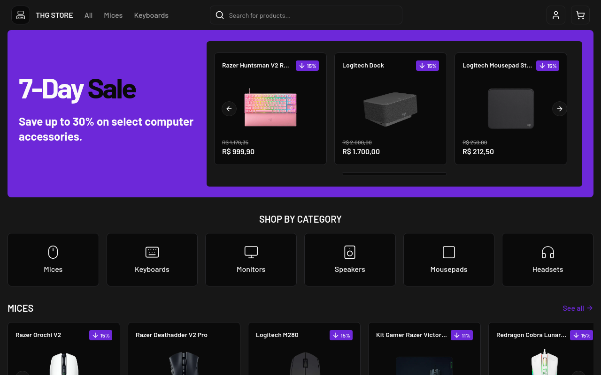

# 🖥️ THG Store

**THG Store** é um e-commerce de periféricos e acessórios para computador.  
O projeto oferece uma experiência completa de navegação, autenticação, filtragem, e checkout.

## ✨ Funcionalidades

- 🛍️ Catálogo de produtos com filtros e busca
- 🛒 Carrinho de compras dinâmico
- 🔒 Autenticação segura com Next-Auth
- 💸 Pagamentos integrados com Stripe
- 📱 Interface responsiva e moderna
- 🚀 Carregamento otimizado com Next.js 15
- 🔄 Atualizações em tempo real com Tanstack Query

## 🛠️ Tecnologias Utilizadas

- **[Next.js 15](https://nextjs.org/)**
- **[TanStack Query](https://tanstack.com/query/latest)**
- **[React Intersection Observer](https://www.npmjs.com/package/react-intersection-observer)**
- **[NextAuth v5](https://authjs.dev/)**
- **[Zustand](https://zustand-demo.pmnd.rs/)**
- **[Supabase](https://supabase.com/)**
- **[Prisma ORM](https://www.prisma.io/)**
- **[Stripe](https://stripe.com/)**
- **[Shadcn UI](https://ui.shadcn.com/)**
- **[TailwindCSS](https://tailwindcss.com/)**