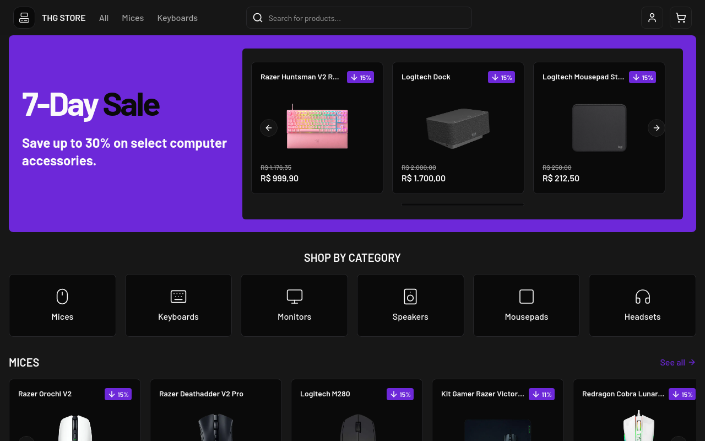

# THG Store 💻

Este projeto é um e-commerce que foi desenvolvido durante a Full Stack Week, um evento dirigido por [Felipe Rocha](https://github.com/felipemotarocha), com 4 lives de muito conteúdo. Nosso objetivo principal foi criar um projeto altamente relevante, utilizando as tecnologias mais modernas e requisitadas pelo mercado.

## Tecnologias Utilizadas 🚀

- **Next.js 13**: Um framework React que oferece renderização do lado do servidor (SSR), geração estática (SSG), entre muitos outros recursos.

- **React Query**: Uma biblioteca para gerenciar o estado de dados de forma eficiente, especialmente em aplicações React.

- **React Intersection Observer**: Facilita a observação de elementos que entram ou saem da viewport, sendo útil para implementar lógica baseada em scroll.

- **Next Auth**: Biblioteca para autenticação de usuários com OAuth.

- **Zustand**: Uma biblioteca de gerenciamento de estado para React que enfatiza simplicidade e performance.

- **Postgres**: Sistema de gerenciamento de banco de dados relacional.

- **Prisma**: ORM (Object-Relational Mapping) para Node.js e TypeScript, simplificando a interação com o banco de dados.

- **shadcn/ui**: Biblioteca de componentes de IU reutilizáveis e estilizáveis.

- **Tailwind CSS**: Framework CSS que oferece várias classes para utilização já pré-estilizadas.

- **API do Stripe**: Uma API de pagamento popular para processar pagamentos online de forma segura.

## Funcionalidades 📦

- **Login com o Google**: Possibilita aos usuários realizar o login usando suas contas do Google, proporcionando uma autenticação simplificada.

- **Navegação por Categorias**: Os usuários podem explorar produtos por categorias, facilitando a busca e a compra.

- **Busca por Produtos**: Implementada a funcionalidade de busca para que os usuários possam encontrar produtos facilmente.

- **Filtragem de Produtos por Preços**: Capacidade de filtrar produtos com base nos preços, tanto em ordem crescente quanto decrescente.

- **Gerenciamento do Carrinho de Compras**: Permite aos usuários adicionar, remover e ajustar a quantidade de produtos no carrinho de compras conforme necessário.

- **Pagamento do Pedido com a API do Stripe**: Oferecendo uma experiência segura de pagamento online com a integração da API do Stripe, incluindo o uso de webhooks para processar eventos relacionados ao pagamento. Os usuários podem concluir seus pedidos com facilidade e segurança.

- **Histórico de Pedidos**: Um histórico detalhado dos pedidos dos usuários, permitindo que eles visualizem suas compras recentes.